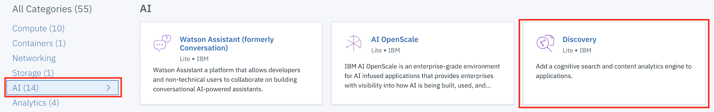
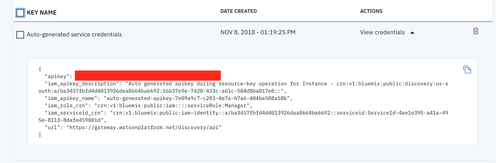
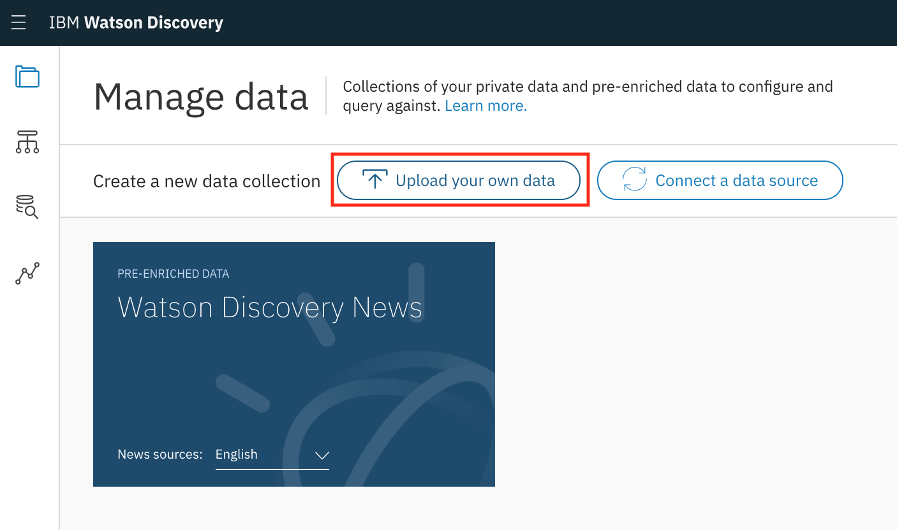

[](https://travis-ci.org/IBM/watson-discovery-analyze-data-breaches)

# Use the Watson Discovery Service Walkthough - Analyzing Cyber security breaches

In this walkthrough you will upload your own data into the Watson Discovery Service. To do this you will provision the Discovery service, load the data and query the data.

## During the walkthough you will explore and learn how to:
1. Provision the Discovery service with storage for your data
2. Explore the data the spreadsheet - convert to JSON (PDF, Word, HTML)
3. Define a new data collection and load the data files - Discovery only supports JSON, PDF, Word and HTML so a applet was built to convert the CSV to a set of JSON Documents. Note the languate options - language options [English, German, Spanish, Arabic, French, Italian, Korean, or Brazilian Portuguese.]
4. Explore the Schema - Walk through the enrichments introduced by Discovery by comparing the CSV to the enriched JSON documents. Discovery will enrich (add cognitive metadata to) the text field of your documents with semantic information collected by four Watson Enrichments — Entity Extraction, Sentiment Analysis, Category Classification, and Concept Tagging (learn more about them here).
5. Note the configuration options - understand the default configuration, the Discovery default configuration will enrich (add cognitive metadata to) the text field of your ingested documents with semantic information collected by these four Watson functions - Entity Extraction, Sentiment Analysis, Category Classification, and Concept Tagging. (There are a total of nine Watson enrichments available; the others are Keyword Extraction, Relation Extraction, Emotion Analysis, Element Classification, and Semantic Role Extraction.)
6. Querying the data set
7. Filtering by original fields
8. Filtering by enriched fields
9. Show custom configuration setup - add a new enrichment to the title field
10. Use Watson Exploreer to call the service from out side of the tooling using the supplied credentials

Later you can configure a full web application so that it can query the data collection you created. For now we want to learn more about the service. 

Before you start you must 
## Sign up for IBM Cloud
If you are not already signed up for the IBM Cloud, [sign up here](https://console.bluemix.net)


## Walkthrough Steps

### 1. Create an instance of the Watson Discovery Service 

1.1 From the IBM Cloud Dashboard click on **Create resource**


1.2 Select the **Watson** category project type and then click on **Discovery**


1.3 Make sure the **Lite plan** is selected and then click **Create**


1.4 Select **Service credentials** at the left and then click on **View credentials** next to the credentials generated for your service instance


1.5 Click on the icon to copy the credentials to the clipboard and then save them in a text file on your Desktop (or some other convenient location). You'll need the **username** and **password** values later in the lab.


### 2. Explore the data
We're going to use a public data set that lists cyber security breaches between 2004 and 2017. The data is available as a spreadsheet on [Google Docs](https://docs.google.com/spreadsheets/d/1Je-YUdnhjQJO_13r8iTeRxpU2pBKuV6RVRHoYCgiMfg/edit#gid=322165570). You can download the data set as comma-separated values (CSV) by clicking File > Download as and then selecting the .csv file format. 


<p align="center">
  
</p>

Watson Discovery Service can import documents in various formats, including PDFs, Word documents, HTML files, and JSON files. CSV files are not accepted by the service, so we created a script to convert the data from CSV to JSON format. The script creates one JSON file for each row in the CSV file. You can find the resulting JSON files in the data directory of the repository. Here’s an example JSON file: 
<p align="center">
  
</p>


### 3. Load the Discovery files


3.1 Launch the **Watson Discovery** tool. 
<p align="center">
  
</p>


3.2 Create a data collection
<p align="center">
  
</p>

3.2 Setting up your storage

 You may get this message if storage has not already been setup
<p align="center">
  
</p>

3.3 Give the  **new data collection** a unique name.
<p align="center">
  
</p>

3.4 Under `Add data to this collection` use `Drag and drop your documents here or browse from computer` to seed the content with the json files in `data/breaches/`.


### 4. Explore the schema

4.1 Once the data is injested a summary panel is displayed:
<p align="center">
  
</p>

4.2 Click on the View Data Schema on the top right to view the Data Schema:
<p align="center">
  
</p>

### 5. Query the data set

Now that you’ve got your data into a collection, you can start having fun by running queries against your data set. The tooling for the Watson Discovery Service provides some utilities to help you with building queries. Click the **Build Queries Icon** to build your own queries 

<p align="center">
  
</p> 

 This brings up the query building form. This interface enables you to compose a query by specifying keywords, aggregations and filters. To begin with, just leave all fields blank and click the Run Query button. Alternatively you can run any of the sample queries generated on the top right of the panel. 
 
 <p align="center">
  
</p> 
 
 In the panel on the right, you should now see the results from running this query.
 
<p align="center">
  
</p> 
 
  You can use this interface to explore the data in the collection. Click the disclosure icons to expand and contract fields. You should find that each result corresponds to one of the JSON files that you uploaded earlier. All of the original fields from the JSON file are there, and you’ll find some additional fields too: id, score, extracted_metadata, and enriched_text. If you drill down into the enriched_text field, you’ll find fields such as entities, docSentiment, taxonomy, and so on. When your data was imported to the Watson Discovery Service, enrichments were applied to the text field, and these fields are the result of that process. 


## 6. Filtering by original fields
Take another look at the fields in the original JSON files that you uploaded to your collection. It might be useful to filter the data set on fields such as year, no_of_records_stolen, organisation, and method_of_leak. For example, let’s filter the collection to show all of the records where method_of_leak is hacked. In the query builder, enter the following in the Narrow your results (filter) field:
    method_of_leak:hacked
Then click the Run query button. In the right column, you should now see the result list filtered: 

<p align="center">
  
</p> 


Try modifying that query to show all the records where the method_of_leak is 'accidentally published'. Now try modifying it to show results where year is 2017, or where organisation is 'healthcare'. You can apply more than one filter at a time by separating your terms with a comma. For example, to show all hacks that affected healthcare organisations, use this:


    organisation:'healthcare',method_of_leak:'hacked'
    
<p align="center">
  
</p> 


The Watson Discovery Service makes it easy to query your data set by these original fields that were included in the original documents. 

## 7. Filtering by generated fields
Take another look at the fields that come under enriched_text. These fields weren’t there in the original data set. They were generated by the enrichment process. You can just as easily run queries against these generated fields. For example, let’s filter the collection to show all of the records where 'bank account' is mentioned in the text field. In the query builder, enter the following in the Narrow your results (filter) field:

    enriched_text.categories.label:"/health and fitness"

Click the Run query button. In the right column, you should now see the result list filtered: In the same way, you could adapt this query to filter on other fields within the enriched_text field. Try modifying that filter to only show results where the docSentiment has type:'positive'. As you can see, applying filters on generated fields is just as easy as filtering on fields from the original dataset.

## 8. Applying enrichments to your own data
When you upload a JSON file to your Watson Discovery collection using the default configuration, it applies enrichments to the text field. In the resulting data set, you can find those enrichments under the enriched_text key. If your data has other fields that you’d like to apply enrichments to, you can create a custom configuration. On the Your data page that summarizes the status and API information for your collection, you should see a Configuration section. 

<p align="center">
  
</p> 


Click the Switch link, and then Create a new configuration. Give your custom configuration a name and then click Create. 
<p align="center">
  
</p> 
You can upload sample documents and use them to test your configuration. For example, if you upload the 001.json file and apply the default configuration to it you should see something like this: 
<p align="center">
  
</p> 

Notice how the preview in the right panel contains an enriched_text field with all of the specified enrichments. If you wanted to extract entities from the title field, you could set up your configuration like this: This time in the preview panel there’s an additional enriched_title field. With the title of “Netflix Twitter account” in the sample document, the Netflix and Twitter entities have been extracted and labelled with type:'company'. 

<p align="center">
  
</p> 

You can tweak your configuration to apply whichever enrichments you need to each of the appropriate fields from your data. I hope these steps will help you get started with your own data sets and the Watson Discovery Service. Leave a comment below and let me know how it goes! 

## 9. Using queries in your own application
The API documentation describes how to run a query against your own collection programatically. For example, to show results where method_of_leak:hacked using curl, you could run:

curl -u "{username}":"{password}"
\ "https://gateway.watsonplatform.net/discovery/api/v1/environments/{environment_id}/collections/{collection_id}/query?version=2016-12-01&filter=method_of_leak:hacked&return=text"


If you replace the {username}, {password}, {environment_id}, and {collection_id} placeholders with the appropriate keys for your Watson Discovery Service, you should see the same results as when you ran that query through the tooling. This developer journey app uses the Node client to connect to the Watson Discovery Service and run queries against it. You can use it as a reference to help you build an application that queries your own data set. 

An easy way to test your queries outside of an application is to use the [Watson API Explorer](https://ibm.biz/BdYBfb)

<p align="center">
  
</p> 

For many of the API's you will need additional environment and configuration identifiers.  You can get them from the summary panel as shown below:

<p align="center">
  
</p> 

# If you want to see a full application 


This example is part of a code pattern so it has an associated application that you can run so that it can query the data collection you created. The web app allows you to explore that data.

Once you have completed this Code Pattern, you will know how to:

* Build and run a Node.js API server with a HTML frontend written in React
* Configure Watson Discovery to build and enrich private data collections
* Use Watson Discovery to query and analyze data


## Flow
1. The **cyber breach** json files are added to the Discovery collection.
2. The user interacts with the backend server via the app UI. The frontend app UI uses React to render search results and can reuse all of the views that are used by the backend for server side rendering. The frontend is using watson-react-components and is responsive.
3. User input is processed and routed to the backend server, which is responsible for server side rendering of the views to be displayed on the browser. The backend server is written using express and uses express-react-views engine to render views written using React.
4. The backend server sends user requests to the Watson Discovery Service. It acts as a proxy server, forwarding queries from the frontend to the Watson Discovery Service API while keeping sensitive API keys concealed from the user.

# Included components

* [Watson Discovery](https://www.ibm.com/watson/developercloud/discovery.html): A cognitive search and content analytics engine for applications to identify patterns, trends, and actionable insights.

# Featured technologies

* [Node.js](https://nodejs.org/en/) - An asynchronous event driven JavaScript runtime, designed to build scalable applications
* [React](https://facebook.github.io/react/) - Javascript library for building User Interfaces
* [Express](https://expressjs.com) - A popular and minimalistic web framework for creating API and Web server

# Watch the Video

[](https://youtu.be/zAu9tHefdDc)

# Steps

Use the ``Deploy to IBM Cloud`` button **OR** create the services and run locally.

## Deploy to IBM Cloud
[](https://bluemix.net/deploy?repository=https://github.com/IBM/watson-discovery-analyze-data-breaches.git)

1. Press the above ``Deploy to IBM Cloud`` button and then click on ``Deploy``.

2. In **Toolchains**, click on **Delivery Pipeline** to watch while the app is deployed. Once deployed, the app can be viewed by clicking **View app**.

<p align="center">
  
</p>

3. To see the app and services created and configured for this Code Pattern, use the IBM Cloud dashboard. The app is named `watson-data-breaches` with a unique suffix. The following services are created:

    * breaches-discovery-service

## Run locally
> NOTE: These steps are only needed when running locally instead of using the ``Deploy to IBM Cloud`` button.

1. [Clone the repo](#1-clone-the-repo)
2. [Create IBM Cloud services](#2-create-ibm-cloud-services)
3. [Load the Discovery files](#3-load-the-discovery-files)
4. [Configure credentials](#4-configure-credentials)
5. [Run the application](#5-run-the-application)

## 1. Clone the repo

Clone the `watson-discovery-analyze-data-breaches` repo locally. In a terminal, run:
```
$ git clone https://github.com/ibm/watson-discovery-analyze-data-breaches
```
We'll be using the folder [`data/breaches/`](data/breaches/)

### 2. Create IBM Cloud services

Create the following services:

* [**Watson Discovery**](https://console.ng.bluemix.net/catalog/services/discovery)

### 3. Load the Discovery files

Launch the **Watson Discovery** tool. Create a **new data collection**
and give the data collection a unique name.

<p align="center">
  
</p>

> Save the **environment_id** and **collection_id** for your `.env` file in the next step.

Under `Add data to this collection` use `Drag and drop your documents here or browse from computer` to seed the content with the json files in `data/breaches/`.


### 4. Configure credentials

The credentials for the IBM Cloud Discovery service can be found in the ``Services`` menu in IBM Cloud,
by selecting the ``Service Credentials`` option for the service.

The other settings for Conversation and Discovery were collected during the
earlier setup steps (``DISCOVERY_COLLECTION_ID``, ``DISCOVERY_ENVIRONMENT_ID`` and
``WORKSPACE_ID``).

Copy the [`env.sample`](env.sample) to `.env`.

```
$ cp env.sample .env
```
Edit the `.env` file with the necessary settings.

#### `env.sample:`

```
# Replace the credentials here with your own.
# Rename this file to .env before starting the app.

# Watson Discovery
DISCOVERY_USERNAME=<add_discovery_username>
DISCOVERY_PASSWORD=<add_discovery_password>
DISCOVERY_ENVIRONMENT_ID=<add_discovery_environment>
DISCOVERY_COLLECTION_ID=<add_discovery_collection>

# Run locally on a non-default port (default is 3000)
# PORT=3000
```

### 5. Run the application
1. Install [Node.js](https://nodejs.org/en/) runtime or NPM.
1. Start the app by running `npm install`, followed by `npm start`.
1. Use the chatbot at `localhost:3000`.
> Note: server host can be changed as required in server.js and `PORT` can be set in `.env`.

# Sample output


# Troubleshooting

* Error: Environment {GUID} is still not active, retry once status is active

  > This is common during the first run. The app tries to start before the Discovery environment is fully created. Allow a minute or two to pass. The environment should be usable on restart. If you used `Deploy to IBM Cloud` button the restart should be automatic.

* Error: Only one free environent is allowed per organization

  > To work with a free trial, a small free Discovery environment is created. If you already have a Discovery environment, this will fail. If you are not using Discovery, check for an old service thay you may want to delete. Otherwise use the `.env DISCOVERY_ENVIRONMENT_ID` to tell the app which environment you want it to use. A collection will be created in this environment using the default configuration.

# Links

* [Demo on Youtube](https://youtu.be/zAu9tHefdDc): Watch the video.
* [Watson Node.js SDK](https://github.com/watson-developer-cloud/node-sdk): Download the Watson Node SDK.
* [Blog: Bring your own data to Watson Discovery Service](doc/index.md): Steps to building the data for this Code Pattern.
* [Data set: World’s biggest data breaches (Information is Beautiful)](http://www.informationisbeautiful.net/visualizations/worlds-biggest-data-breaches-hacks/): Check out the data set used for this Code Pattern, as well as others available for you to use.
* [Watson Discovery, an IBM API adding value to corporate data](https://bbvaopen4u.com/en/actualidad/watson-discovery-ibm-api-adding-value-corporate-data): Dive into IBM Watson Discovery Service, enabling companies to structure and understand large masses of data.
* [Blog: Watson Discovery Service – Understand your data at scale with less effort](https://www.ibm.com/blogs/watson/2016/12/watson-discovery-service-understand-data-scale-less-effort/): Align and connect different data sets to expose critical correlations and causal factors.
* [Blog: Using IBM Watson Discovery to query unstructured data](https://dzone.com/articles/using-ibm-watson-discovery-to-query-unstructured-d): Make sense of and identify patterns in large amounts of unstructured data.
# Learn more

* **Artificial Intelligence Code Patterns**: Enjoyed this Code Pattern? Check out our other [AI Code Patterns](https://developer.ibm.com/code/technologies/artificial-intelligence/).
* **AI and Data Code Pattern Playlist**: Bookmark our [playlist](https://www.youtube.com/playlist?list=PLzUbsvIyrNfknNewObx5N7uGZ5FKH0Fde) with all of our Code Pattern videos
* **With Watson**: Want to take your Watson app to the next level? Looking to utilize Watson Brand assets? [Join the With Watson program](https://www.ibm.com/watson/with-watson/) to leverage exclusive brand, marketing, and tech resources to amplify and accelerate your Watson embedded commercial solution.

# License
[Apache 2.0](LICENSE)
